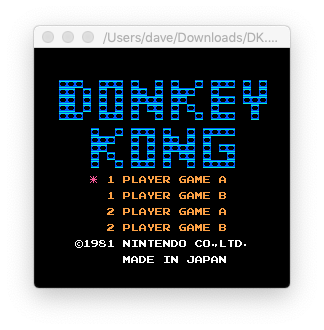
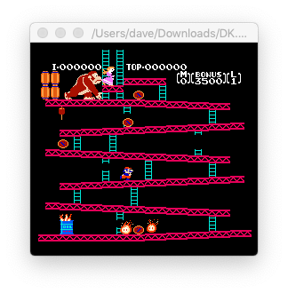

# DDNES
DDNES is a very primitive NES emulator. This is a personal learning project for me that I don't expect to be especially useful to anyone else. As I have time, I'm implementing an NES emulator in C with SDL. I'm doing this through a combination of my own code, information from the guides at [nesdev.com](https://www.nesdev.com/), various bits and pieces of documentation all over the Web, and porting parts of (especially the PPU background rendering) [Michael Fogleman's excellent Go NES emulator](https://github.com/fogleman/nes). I'm not being a purist about this—I am looking at other people's code as I get stuck. Right now the 6502 CPU core seems to be working pretty well and the PPU (picture processing unit) can display basic backgrounds and sprites. At present, it can play the games Donkey Kong, Tennis, Baseball, Super Mario Brothers, and 1942 pretty much correctly, albeit with partially working sound.

 
 

This will never be anything impressive, and it's not code I'm proud of... it's more of a hack as I have time. If you want to look at good code, please checkout Michael's project. My original plan was just to get Donkey Kong working and call it a day. I've gone slightly beyond that, getting some other NROM games playing, but I've already achieved my goals with the project.

## Building

If for some very strange reason you wanted to build this code for this not-fully-working emulator, it comes bundled as a project for Xcode w/ SDL included in this repository, as well as a separate solution for Visual Studio 2019. It takes the file containing the game to play as the single command-line argument, which is specified in Xcode's Scheme configuration window, or Visual Studio's project properties debugging tab. Right now only Mapper 0 (NROM) is implemented.

## Controls

a -> x  
b -> z  
start -> s  
select -> a  
d-pad -> arrow keys

## License

Licensed under the [Apache License](LICENSE).

Michael Fogleman's emulator that this is partially a port of (especially parts of the PPU) is licensed under the [MIT License](https://github.com/fogleman/nes/blob/master/LICENSE.md).

## To-Do
- [X] Memory Map
- [X] CPU Core
- [X] Basic PPU Background Rendering
- [X] Basic Sprites
- [X] Controller Support through keyboard
- [X] Playable Donkey Kong
- [X] APU (Audio Processing Unit)... work in progress but sorta kinda working a bit

## Useful Links
- [Michael Fogleman's Go NES Emulator](https://github.com/fogleman/nes) - the background rendering of the PPU is largely a port of his code from Go to C along with some bits from nesdev forums
- [Stanislav Yaglo's mynes](https://github.com/yaglo/mynes) - I looked at some of his code when I ran into bugs in my ADC & SBC instructions' overflow flag setting as well as some sprite rendering bugs
- [nesdev.com](https://www.nesdev.com/)
- [Nintaco](http://nintaco.com) - one of the only NES emulators with a good debugger that runs on macOS (Java)
- [Maciform](https://github.com/macifom/macifom) - an NES emulator with a very basic debugger written in Objective-C that you can build for the Mac natively (at least as of 10.13, although builds you'll find online don't work; you need to build it yourself)
